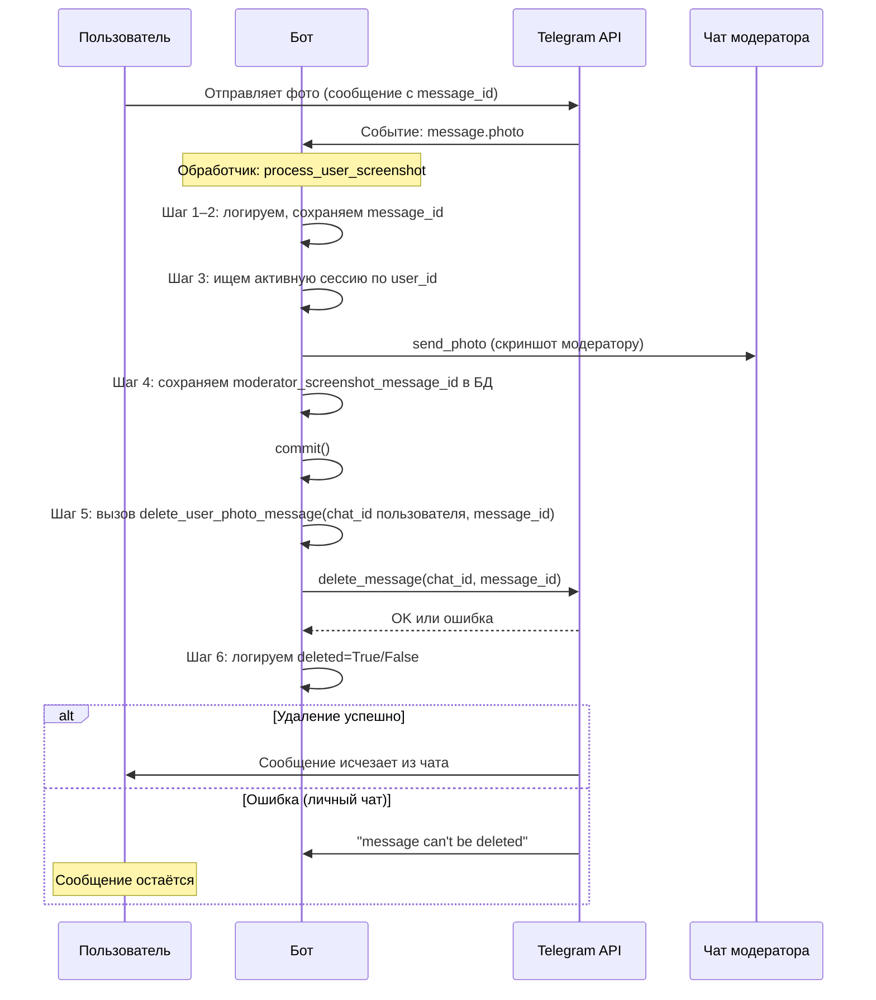
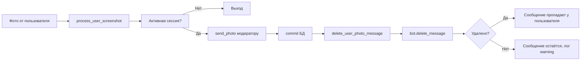

# План: как удаляется сообщение пользователя после отправки скриншота модератору

**Где этот файл:** в проекте папка `plans`, файл `схема-удаление-сообщения-пользователя.md` (полный путь: `money\plans\схема-удаление-сообщения-пользователя.md`).

---

## Где смотреть логи

Логи пишутся **в консоль** (терминал), а не в файл. В коде нет записи в log-файл.

- **Запуск бота из терминала** (например `python bot.py`): все логи идут в этот же терминал. Отправьте фото боту и смотрите вывод — строки с `[USER_PHOTO]` идут подряд (шаги 1–6).
- **Сохранить логи в файл при запуске:** в терминале запустите:  
  `python bot.py > logs.txt 2>&1`  
  Тогда весь вывод окажется в `logs.txt` в текущей папке; потом откройте файл и поиском найдите `[USER_PHOTO]`.

---

## Что происходит у вас

Сообщение удалилось сразу после отправки модератору — значит цепочка сработала: бот получил фото, отправил его модератору, затем вызвал удаление сообщения пользователя, и Telegram выполнил удаление (в вашем случае — успешно).

---

## Разбор ваших логов (фото с телефона, сообщения исчезли)

По логам из терминала (2026-02-20 20:01:57) видна полная цепочка. Итог: **сообщение 213 в чате пользователя 8070278708 было удалено Telegram’ом по запросу бота**, поэтому на телефоне оно исчезло.

| Время     | Модуль                | Событие |
|-----------|------------------------|--------|
| 20:01:57,406 | handlers.user_handlers | **Шаг 1/6:** Бот получил фото. user_id=8070278708, chat_id=8070278708, **message_id=213** (это сообщение с фото в чате пользователя). |
| 20:01:57,406 | handlers.user_handlers | **Шаг 2/6:** Сохранён message_id=213 для последующего удаления. |
| 20:01:57,409 | handlers.user_handlers | **Шаг 3/6:** Найдена активная сессия. application_id=15, moderator_id=6341142035. Скриншот отправляется модератору. |
| 20:01:57,523 | handlers.user_handlers | **Шаг 4/6:** Скриншот отправлен модератору. В чате модератора это сообщение получило id=214 (moderator_screenshot_message_id=214). |
| 20:01:57,527 | handlers.user_handlers | **Шаг 5/6:** Вызов **delete_user_photo_message**(chat_id=8070278708, message_id=213). |
| 20:01:57,527 | utils.user_messages   | **delete_user_photo_message** вызвана, отправлен запрос bot.delete_message(8070278708, 213). |
| 20:01:57,632 | utils.user_messages   | **Удаление успешно:** сообщение 213 удалено, result=True. |
| 20:01:57,632 | handlers.user_handlers | **Шаг 6/6:** Результат deleted=True. |

**Почему сообщения исчезли на телефоне:** бот вызвал `delete_message(chat_id=8070278708, message_id=213)`, Telegram API вернул успех (result=True). Чат 8070278708 — это ваш чат с ботом; сообщение 213 — это как раз отправленное вами фото. Telegram удалил его, поэтому в клиенте на телефоне оно пропало. Поведение соответствует коду: удаление выполняется сразу после отправки скриншота модератору (шаг 4 → 5 → 6).

---

## Схема потока (от фото до удаления)

---

## Пошагово по коду и логам

| Шаг | Где в коде | Что делается | Что смотреть в логах |
|-----|------------|--------------|----------------------|
| 1 | `process_user_screenshot` (user_handlers) | Бот получил апдейт с фото | `[USER_PHOTO] Шаг 1/6: Бот получил фото` + user_id, chat_id, message_id |
| 2 | Там же | Берём message_id сообщения пользователя | `[USER_PHOTO] Шаг 2/6: Сохранён message_id ... для удаления: <id>` |
| 3 | Там же | Ищем активную сессию, сохраняем file_id, решаем отправить модератору | `[USER_PHOTO] Шаг 3/6: Найдена активная сессия` + application_id, moderator_id |
| 4 | Там же | send_photo модератору, сохранение message_id в БД | `[USER_PHOTO] Шаг 4/6: Скриншот отправлен модератору` + moderator_screenshot_message_id |
| 5 | Там же → вызов | Вызов функции удаления в чате пользователя | `[USER_PHOTO] Шаг 5/6: Вызов delete_user_photo_message(...)` и сразу следом `[USER_PHOTO] delete_user_photo_message вызвана` |
| 6a | delete_user_photo_message (user_messages) | bot.delete_message(chat_id, message_id) | `delete_user_photo_message: сообщение <id> удалено успешно` |
| 6b | process_user_screenshot | Результат удаления | `[USER_PHOTO] Шаг 6/6: Результат ... deleted=True` |

Если удаление не прошло (например, личный чат): в логах будет `TelegramBadRequest` и `Шаг 6/6: ... deleted=False`, плюс предупреждение про ограничение Telegram.

---

## Почему у вас сообщение удалилось

В ваших логах: **delete_message вернул result=True** — Telegram разрешил удаление. Поэтому сообщение с фото исчезло в чате на телефоне.

Возможные причины, почему API разрешил удаление:
- Чат с ботом (личный): в части случаев/клиентов Telegram допускает удаление сообщений пользователя ботом (поведение может отличаться по клиентам и версиям).
- Либо чат не личный (группа/супергрупп), и у бота есть право удалять сообщения.

В коде ничего не меняется: мы всегда вызываем `delete_user_photo_message` сразу после отправки скриншота модератору. Порядок: сначала отправка модератору и commit, потом удаление в чате пользователя.

---

## Краткая схема (блок-схема)

---

## Итог

- Момент, когда бот «получил фото» — это вызов обработчика **`process_user_screenshot`** (handlers.user_handlers) по событию `message.photo`.
- Удаление в чате пользователя выполняется одной функцией: **`delete_user_photo_message`** (utils.user_messages), вызываемой из того же обработчика сразу после отправки скриншота модератору.
- По логам с префиксом `[USER_PHOTO]` можно проследить весь путь от получения фото до результата удаления (шаги 1–6 и логи внутри `delete_user_photo_message`).
