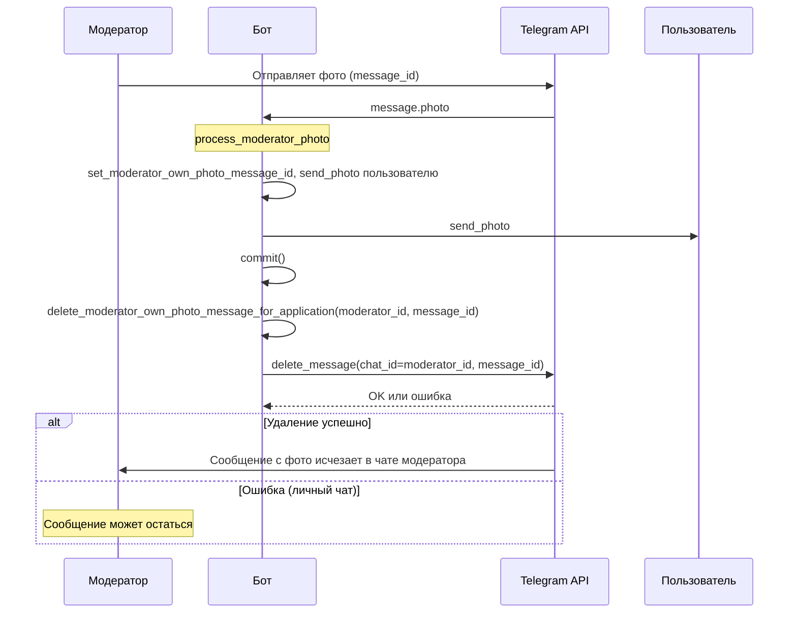

# План: удаление фото модератора по аналогии с удалением фото пользователя

## Цель

Сделать попытку удаления сообщения с фото в чате модератора **сразу после того, как модератор отправил фото** (в том же обработчике), по аналогии с потоком пользователя: пользователь отправил фото → бот отправил скриншот модератору → бот сразу пытается удалить сообщение пользователя. Аналогично: модератор отправил фото → бот отправил фото пользователю → бот сразу пытается удалить сообщение модератора в его чате.

## Текущее состояние

- **Пользователь:** в `process_user_screenshot` (handlers.user_handlers) после отправки скриншота модератору и commit вызывается `delete_user_photo_message(chat_id, message_id)` — удаление в чате пользователя сразу после получения фото.
- **Модератор:** сообщение с фото модератора сейчас удаляется только при approve/reject через `delete_moderator_own_photo_message_for_application` (utils.moderator_messages). В обработчике фото модератора (`process_moderator_photo`) удаление не вызывается.

## Аналогия

| Действие | Пользователь | Модератор (цель) |
|----------|---------------|------------------|
| Получение фото | process_user_screenshot | process_moderator_photo |
| После отправки «на другую сторону» | send_photo модератору → commit | send_photo пользователю → commit |
| Сразу после commit | delete_user_photo_message(chat_id пользователя, message_id) | delete_moderator_own_photo_message_...(moderator_id, message_id) |

## Шаги реализации

### 1. Вызов удаления в process_moderator_photo

**Файл:** [handlers/moderator_handlers.py](handlers/moderator_handlers.py)

**Место:** после успешного `await db_session.commit()` (сразу после блока «Коммитим изменения только после успешной отправки»), до обновления информационного сообщения пользователя.

**Действие:**
- Импортировать (или оставить локальный import) `delete_moderator_own_photo_message_for_application` из `utils.moderator_messages`.
- Вызвать:
  ```python
  await delete_moderator_own_photo_message_for_application(
      bot=bot,
      application_id=application_id,
      moderator_id=message.from_user.id,
      message_id=message.message_id,
  )
  ```
- `message.message_id` — id сообщения с фото в чате модератора; `message.from_user.id` — chat_id модератора (личный чат бота с модератором).

Логика уже есть в `delete_moderator_own_photo_message_for_application`: при переданных `moderator_id` и `message_id` вызывается `bot.delete_message(chat_id=moderator_id, message_id=message_id)` и затем обнуляется поле в БД. Дополнительных изменений в utils не требуется.

### 2. Оставить вызов при approve/reject (опционально)

Текущие вызовы в `callback_moderator_approve` и `callback_moderator_reject` можно оставить как запасной вариант: если удаление в момент отправки фото не сработало (или не выполнялось в старых сессиях), при завершении сессии попытка повторится. При уже удалённом сообщении Telegram вернёт «message not found» — в коде это обрабатывается как успех (логирование в debug).

### 3. Логирование по аналогии с [USER_PHOTO] (опционально)

Для удобной диагностики можно добавить в `process_moderator_photo` логи с префиксом `[MOD_PHOTO]`:
- перед вызовом удаления: что вызывается, moderator_id, message_id, application_id;
- после вызова удаления не обязательно (сама `delete_moderator_own_photo_message_for_application` уже логирует успех/ошибку).

При желании можно добавить в `delete_moderator_own_photo_message_for_application` префикс `[MOD_PHOTO]` в сообщения лога, чтобы по логам легко отфильтровать поток модератора.

## Ограничение Telegram

В личном чате бот может удалять только **свои** сообщения. Сообщение с фото отправил **модератор**, поэтому в личном чате модератора с ботом удаление может не сработать (Telegram вернёт ошибку). Код это обрабатывает (TelegramBadRequest, логирование). Поведение такое же, как при удалении сообщения пользователя в личке: попытка выполняется, при отказе Telegram сообщение остаётся.

## Схема потока (после реализации)



## Чек-лист

- [x] В `process_moderator_photo` после `await db_session.commit()` добавить вызов `delete_moderator_own_photo_message_for_application(bot, application_id, moderator_id=message.from_user.id, message_id=message.message_id)`.
- [x] Убедиться, что импорт `delete_moderator_own_photo_message_for_application` из `utils.moderator_messages` доступен в этом месте (добавлен локальный import в блоке после commit).
- [x] Добавлены логи с префиксом `[MOD_PHOTO]` в момент вызова удаления в обработчике и внутри `delete_moderator_own_photo_message_for_application`.
